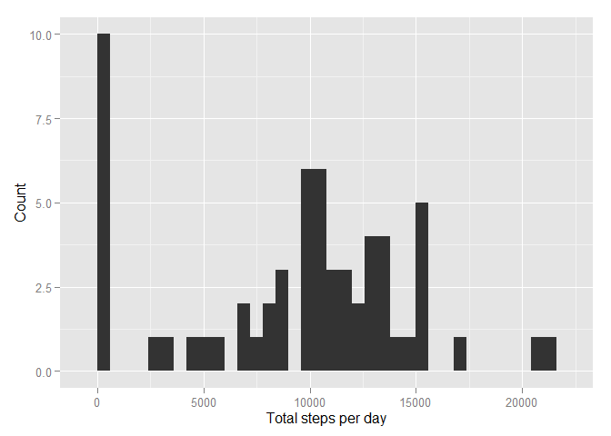
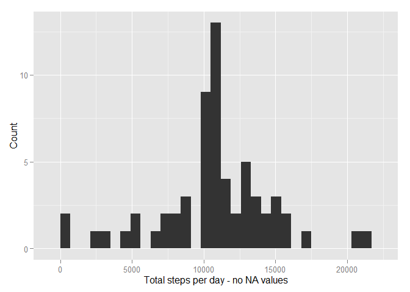
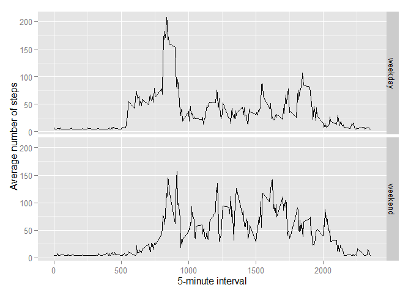

# Reproducible Research: Peer Assessment 1

*by Igor Hut, August 16, 2015*


##### Before we start

```r
echo = TRUE  # Explicitely make code visible
library(ggplot2) 
library(Hmisc)
```

```
## Warning: package 'Hmisc' was built under R version 3.2.2
```

```
## Loading required package: grid
## Loading required package: lattice
## Loading required package: survival
## Loading required package: Formula
```

```
## Warning: package 'Formula' was built under R version 3.2.2
```

```
## 
## Attaching package: 'Hmisc'
## 
## The following objects are masked from 'package:base':
## 
##     format.pval, round.POSIXt, trunc.POSIXt, units
```

```r
options(scipen = 1)  
```


### Loading and preprocessing the data


```r
if(!file.exists('activity.csv')){
    unzip('activity.zip')
}
data <- read.csv('activity.csv')
```

### What is mean total number of steps taken per day?


```r
totalSteps <- tapply(data$steps, data$date, sum, na.rm=TRUE)
```

##### 1. Make a histogram of the total number of steps taken each day

```r
qplot(totalSteps, xlab='Total steps per day', ylab='Count', binwidth=600)
```

 

##### 2.Calculate and report the mean and median total number of steps taken per day


```r
totalStepsMean <- mean(totalSteps)
totalStepsMedian <- median(totalSteps)
```
###### __Mean: 9354.2295082__
###### __Median:  10395__


### What is the average daily activity pattern?

```r
averageValues<- aggregate(x=list(steps=data$steps), by=list(interval=data$interval),
                      FUN="mean", na.rm=TRUE)
```
##### 1. Make a time series plot


```r
ggplot(data=averageValues, aes(x=interval, y=steps)) +
    geom_line() +
    xlab("5-minute interval") +
    ylab("Average number of steps taken")
```

 


##### 2. Which 5-minute interval, on average across all the days in the dataset, contains the maximum number of steps?


```r
mostSteps<-averageValues[which.max(averageValues$steps),]
```

### Imputing missing values
*There are a number of days/intervals where there are missing values (coded as NA). The presence of missing days may introduce bias into some calculations or summaries of the data, thus let's get rid of them.*

##### 1. Calculate and report the total number of missing values in the dataset 

```r
missingValues <- length(which(is.na(data$steps)))
```

* Number of missing values: 2304

##### 2. Devise a strategy for filling in all of the missing values in the datasetThe strategy does not need to be sophisticated. For example, you could use the mean/median for that day, or the mean for that 5-minute interval, etc.

* All of the missing values will be substituted with mean values for the given 5-minute intervals.*


##### 3. Create a new dataset that is equal to the original dataset but with the missing data filled in.

```r
noNAdata <- data
noNAdata$steps <- impute(data$steps, fun=mean)


##### 4. Using this new filled data set, let's make a histogram of the total number of steps taken each day and calculate the mean and median total number of steps taken per day.
```

```r
totalStepsNoNA <- tapply(noNAdata$steps, noNAdata$date, sum)
qplot(totalStepsNoNA, xlab='Total steps per day - no NA values', ylab='Count', binwidth=700)
```

 

* The mean and median total number of steps taken per day. 

```r
totalStepsNoNAmean <- mean(totalStepsNoNA)
totalStepsNoNAmedian <- median(totalStepsNoNA)
```
###### __Mean (Imputed): 10766.1886792__
###### __Median (Imputed):  10766.1886792__

As can be observed mean and median values are higher after filling in the missing data. In the original data, there are some days with `steps` values `NA` for any `interval`. The total numbers of steps taken in these days are set to 0s by default. After replacing missing `steps` values with the mean `steps` values of corresponding `interval` values, 0's values are removed from the histogram of the total number of steps per each day.


### Are there differences in activity patterns between weekdays and weekends?

##### 1. Create a new factor variable in the dataset with two levels - "weekday" and "weekend" indicating whether a given date is a weekday or weekend day.


```r
dayType <- function(date) {
    day <- weekdays(date)
    if (day %in% c("Monday", "Tuesday", "Wednesday", "Thursday", "Friday"))
        return("weekday")
    else if (day %in% c("Saturday", "Sunday"))
        return("weekend")
    else
        stop("invalid date")
}
noNAdata$date <- as.Date(noNAdata$date)
noNAdata$day <- sapply(noNAdata$date, FUN=dayType)
```

##### 2. Make a panel plot containing a time series plot


```r
avg <- aggregate(steps ~ interval + day, data=noNAdata, FUN="mean")
ggplot(avg, aes(interval, steps)) + geom_line() + facet_grid(day ~ .) +
    xlab("5-minute interval") + ylab("Average number of steps")
```

 


